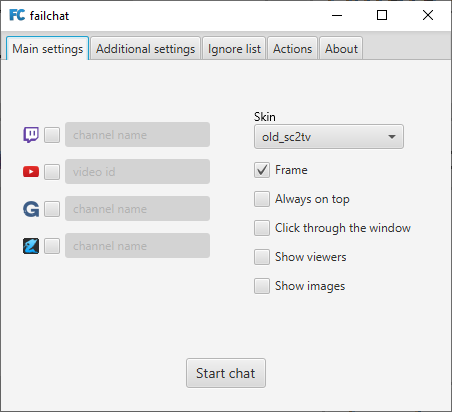
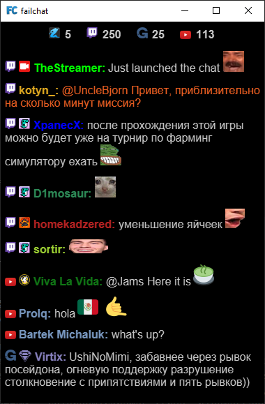
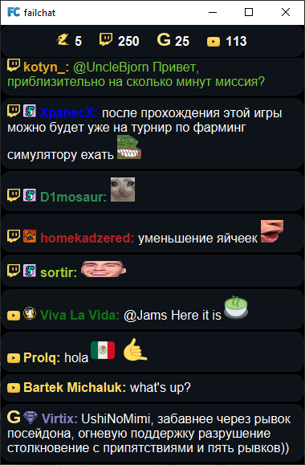
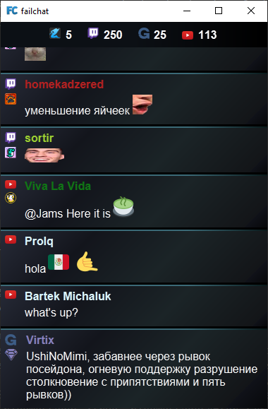

# Ключевые особенности чата
- Поддерживаемые источники:
  - Twitch
  - Youtube
  - Goodgame
  - Sc2tv
- Исходный код чата полностью открыт. Чат был и будет бесплатным
- Чат кроссплатформенный, но для Windows есть дополнительные фичи
- Чат можно захватить в OBS через Browser source
- Чат работает в режиме только чтения и не позволяет отправлять сообщения

# Скриншоты

# Возможности чата
- Отображение количества зрителей
- Смайлы
  - twitch: BTTV, FrankerFaceZ, 7tv
- Подсветка сообщений стримеру
- Отображение цвета никнейма
- Отображение иконок пользователя
- Режим кликов мыши сквозь окно чата (доступно только на Windows)
- Режим поверх всех окон
- Режим окна без рамок
- Возможность скрыть сообщения после настраиваемого промежутка времени
- Отображение картинок и гифок в чате по ссылке
- Подсветка сообщений за поинты канала на Twitch  
- Кастомизация:
  - Включить/выключить иконки, цвет ника, статусные сообщения
  - Zoom
  - Цвет фона
  - Шаблон для удалённых сообщений
  - Прозрачность окна чата
  - Возможность добавлять свои смайлы
- Сообщение удаляется в failchat'е если оно было удалено в первоисточнике
- Возможность удалить сообщение только в failchat'е, но не в первоисточнике
- Игнор лист
- Сохранение истории чата в текстовый файл
- Возможность очистить все сообщения, а так же временно показать скрытые сообщения
- Разделённая кастомизация для основного окна чата и для OBS Browser'а

# Другое
- Доступно 3 скина
- Возможна кастомизация скина через html/css/javascript
